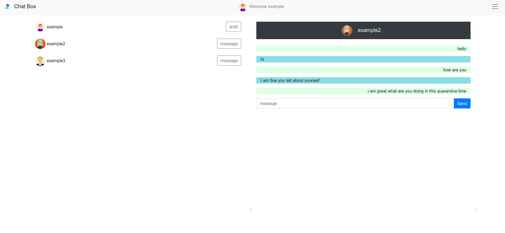
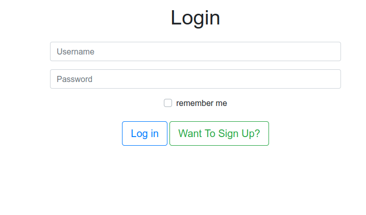
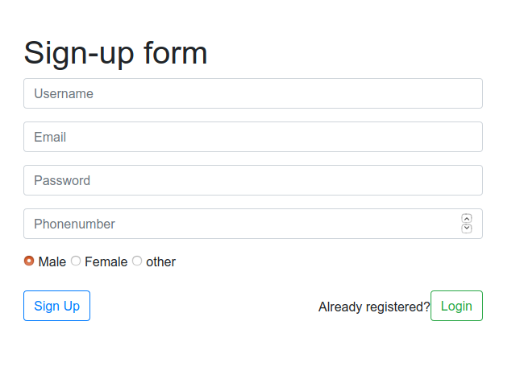
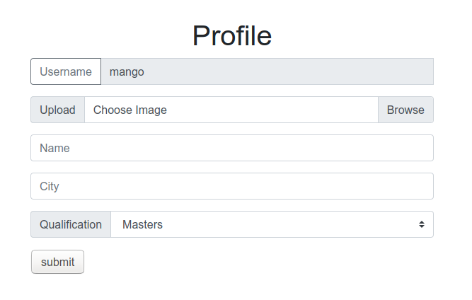

# Chatter

A plane php project to show the as a part of my assignment.

This is a complete **_chat app_** with great [bootstrap](https://getbootstrap.com/) design and all the necessary features .

>**Home page**

# 

## Table of contents 
1. [Technologies](#technologies)
2. [Features](#features)
3. [Development](#Development)

# Technologies

- [mdbootstrap](https://mdbootstrap.com): A Material Design UI kit
- PHP
- Mysql
- javascript 
- AJAX
- Regular Expression

# Features
- log in
- sign up
- profile set up 
- profile photo upload
- profile editing 
- chatting (without reloading the page)
- log out

>**_login page_**
# 

>**_Sign-up page_**
# 

>**_ profile page_**
# 

## Development 

To set up this App locally, clone this repo to your desktop and install php on your local machine. Then in terminal go to the cloned repo and run 
```
$ mysql -u [username] -p > imgphpassignment.sql
```
Now run the project in any server like apache2 or php default server.For example to run the project through php default server run the following code.
```
$ php -S localhost:[port available like 3000]
```
now to go to your browser and go to localhost.